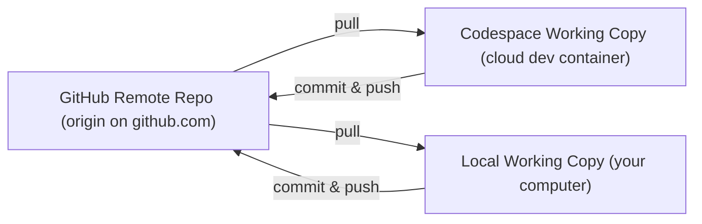

# Python lab for EC3318/MN3101 Financial Economics: Corporate Finance

Welcome to the **the GitHub site for EC3318/MN3101** that contains the files for your computational labs. This specific site is unique to you (have a look at the URL in your browser.) Importantly, you can start your Python coding environment from here without the need to install anything on your own computer.

**For Lab 1, start a Codespace and open `lab1-notebook.ipynb`, which is the key file for the lab.**

Read on to learn more about what a Codespace is, how to start and stop one.

## Getting Started

### What is a Codespace?

A GitHub Codespace is like having a complete computer running in the cloud that you can access through your web browser. Think of it as a virtual computer that already has Python and all the software you need pre-installed and ready to use.

Instead of spending time installing Python, Jupyter notebooks, and various libraries on your own laptop (which can be tricky and time-consuming), you can simply open this repository in a Codespace and start coding immediately. Everything runs in your browser - no downloads or installations required.

The best part? Your Codespace comes with all the files for this course already loaded, and any code you write will be automatically saved to your personal copy of the repository.

### Codespaces, repositories and the files on your computer

Think of three places where your files can live:

- GitHub repository (remote): The source of truth on github.com, the site you can access through your URL mentioned above.
- Codespace (cloud container): Your active working copy in VS Code on the web. You can work with your files here and run code.
- Your computer (local): You can download ("clone") the repository to your own machine.

How they relate:

Key points:

- **Persistence:** Codespaces can stop or be deleted after inactivity. Push your commits to GitHub to keep them safe. Your lecturer has set everything up in a way that this is done automatically and GitHub is always kept up to date.
- **Saving vs committing:** VS Code autosave writes files inside the codespace, but your work is not shared to GitHub until the commit and push has happened.

### Starting a Codespace

1. Click on the **Code** button at the top right of the repository page.
2. Select the + button to the right of Codespaces.

### Managing Your Codespace

**Important:** Codespaces consume computational resources and count towards your monthly usage limits. To avoid unnecessary usage:

- Stop your codespace when you're done working
- You have 120 core hours per month
- Active codespaces will automatically stop after 30 minutes of inactivity
- Stored codespaces are deleted after 30 days of inactivity

### Stopping a codespace

1. In VS Code, click on the **Codespaces** tab on the bottom of the left sidebar.
2. Click on the **Stop Current Codespace** option that appears from the dropdown.

### Signing and verifying with GitHub Education

As a student, you should verify your student status with GitHub Education to unlock additional benefits and resources. This verification gives you:

- **Increased Codespace usage**: More free computational hours each month for your coursework
- **Access to GitHub Copilot**: AI-powered coding assistance that can help you learn and write code more effectively
- **Free access to premium tools**: Many development tools that normally cost money become free for verified students
- **GitHub Pro features**: Advanced repository features at no cost

To verify your student status:

1. Visit [GitHub Education](https://education.github.com/students)
2. Click "Get student benefits"
3. Provide proof of your student status (usually your university email address)
4. Wait for verification (this can take a few days)

**Why this matters for this course**: Without verification, you may hit usage limits on Codespaces, which could prevent you from completing your lab work. The verification process is free and ensures you have sufficient resources for all course activities.

## Getting help

Each programming environment comes with built-in AI assistance via GitHub Copilot. As you code in Python it can provide contextual help.

## Saving your work

As mentioned above, all files will be saved and recorded automatically when any file is saved. Your work is continuously preserved without needing any manual intervention.

## Further resources

- [Tidy Finance](https://www.tidy-finance.org/) - Comprehensive guide to empirical finance using modern data science tools
- [Programming with Python](https://swcarpentry.github.io/python-novice-inflammation/) - Software Carpentry tutorial for Python beginners
- [Plotting and Programming in Python](https://swcarpentry.github.io/python-novice-gapminder/) - Python tutorial using real-world data analysis examples
